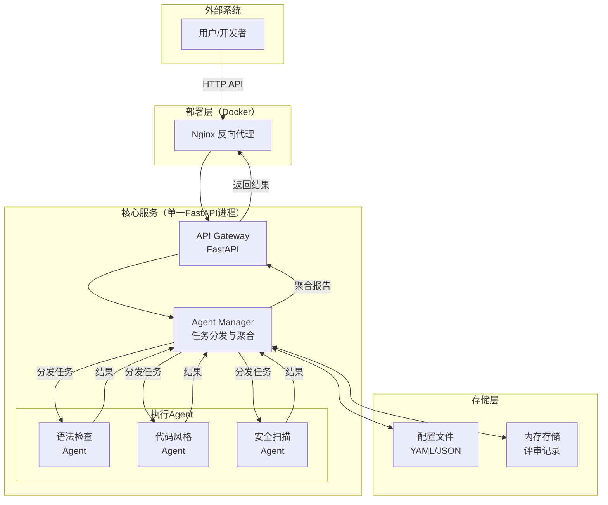
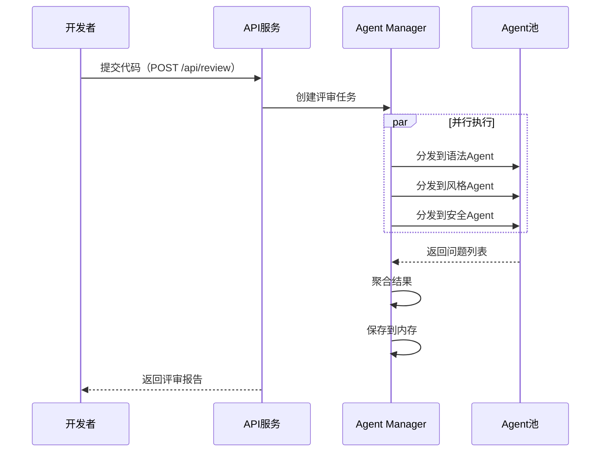

# 多Agent代码自动评审工具 - 技术架构设计

**版本：** V1.0
**基于：** PRD V1.0
**目标：** 轻量化、Python生态、单人可落地

---

## 1. 整体架构图



**架构说明：**
- **单一进程**：所有组件运行在同一个FastAPI进程中，降低部署复杂度
- **异步任务**：使用`asyncio`实现Agent并行执行
- **插件化Agent**：每个Agent独立实现，可热插拔
- **内存存储**：使用字典存储评审记录（适合单机部署）
- **简化架构**：无独立任务调度器，无数据库依赖

---

## 2. 多Agent分工设计

### 2.1 Agent接口规范

```python
# agent/base.py
from abc import ABC, abstractmethod
from dataclasses import dataclass
from typing import List

@dataclass
class Issue:
    file_path: str
    line: int
    column: int
    severity: str  # critical, error, warning, info
    type: str      # syntax, style, security, performance
    message: str
    suggestion: str

@dataclass
class AgentResult:
    agent_name: str
    issues: List[Issue]
    duration_ms: int

class BaseAgent(ABC):
    name: str
    supported_languages: List[str]

    @abstractmethod
    async def analyze(self, file_path: str, content: str) -> AgentResult:
        """执行评审分析"""
        pass

    @abstractmethod
    def should_run(self, file_extension: str) -> bool:
        """判断是否需要运行此Agent"""
        pass
```

### 2.2 各Agent职责

| Agent | 职责 | 检查内容 | 输出 |
|-------|------|----------|------|
| **SyntaxAgent** | 语法检查 | 语法错误、解析失败 | 语法错误位置及修复 |
| **StyleAgent** | 代码风格 | 格式规范、命名约定 | 风格违规及格式化建议 |
| **SecurityAgent** | 安全扫描 | 敏感信息、漏洞模式 | 安全风险及修复方案 |

### 2.3 Agent实现策略

```python
# agent/syntax_agent.py
class SyntaxAgent(BaseAgent):
    name = "syntax"
    supported_languages = ["js", "ts", "py", "java", "go"]

    TOOLS = {
        "js": "eslint --parser-options=ecmaVersion:latest",
        "ts": "eslint --parser=@typescript-eslint/parser",
        "py": "flake8",
        "java": "checkstyle",
        "go": "gofmt -e",
    }

    async def analyze(self, file_path: str, content: str) -> AgentResult:
        # 使用对应语言工具检查语法
        # 返回结构化问题列表
        pass
```

```python
# agent/style_agent.py
class StyleAgent(BaseAgent):
    name = "style"
    TOOLS = {
        "js": "prettier --check",
        "ts": "prettier --check",
        "py": "black --check",
        "go": "gofmt -d",
    }
```

```python
# agent/security_agent.py
class SecurityAgent(BaseAgent):
    name = "security"
    # 内置安全规则 + bandit/gosec 工具
    RULES = [
        (r"password\s*=\s*['\"][^'\"]+['\"]", "hardcoded_password", "critical"),
        (r"eval\s*\(", "eval_usage", "error"),
        (r"subprocess.*shell\s*=\s*True", "shell_injection", "critical"),
        # ... 更多规则
    ]
```


### 2.4 Agent管理器的交互逻辑

```python
# agent/manager.py
class AgentManager:
    def __init__(self, config: Config):
        self.agents: List[BaseAgent] = self._load_agents(config)

    async def run_parallel(self, files: List[CodeFile]) -> ReviewReport:
        """并行执行所有适用的Agent"""
        tasks = []
        for file in files:
            for agent in self.agents:
                if agent.should_run(file.extension):
                    tasks.append(self._run_agent(agent, file))

        # 并行执行
        results = await asyncio.gather(*tasks, return_exceptions=True)

        # 聚合结果
        return self._aggregate_results(results)
```

---

## 3. 技术栈选型

### 3.1 技术栈总览

| 层级 | 技术选型 | 理由 |
|------|----------|------|
| **后端框架** | FastAPI | 异步高性能、自动生成API文档、Python原生 |
| **Web服务器** | Uvicorn | 单进程部署，无需反向代理（Nginx可选） |
| **任务队列** | asyncio（内置） | 并行执行Agent任务 |
| **存储** | 内存存储（dict） | 轻量、零配置、适合单机 |
| **前端** | 静态HTML + Vue3 | 轻量管理界面，无需构建 |
| **部署** | Docker | 一键部署、快速启动 |
| **代码分析** | Pylint/Bandit | Python代码检查 |

### 3.2 依赖清单

```toml
# pyproject.toml
[project]
name = "code-reviewer"
version = "1.0.0"
requires-python = ">=3.10"

dependencies = [
    # Web框架
    "fastapi>=0.104.0",
    "uvicorn[standard]>=0.24.0",

    # 配置管理
    "pydantic>=2.0",
    "pydantic-settings>=2.0",
    "python-dotenv>=1.0",

    # HTTP客户端
    "httpx>=0.25.0",

    # 代码检查工具
    "pylint>=3.0",
    "bandit>=1.7",

    # 异步文件处理
    "aiofiles>=23.2",
]

[project.optional-dependencies]
dev = [
    "pytest>=7.0",
    "pytest-asyncio>=0.21",
]
```

### 3.3 项目结构

```
code-reviewer/
├── app/
│   ├── __init__.py
│   ├── main.py              # FastAPI入口 + 静态文件服务
│   ├── config.py             # 配置管理
│   ├── logger.py             # 日志模块
│   ├── api/
│   │   ├── __init__.py
│   │   ├── routes.py         # API路由（含简单认证）
│   │   └── webhooks.py       # Webhook处理
│   ├── agents/
│   │   ├── __init__.py
│   │   ├── base.py           # Agent基类
│   │   ├── manager.py        # Agent管理器
│   │   ├── syntax.py         # 语法Agent
│   │   ├── style.py          # 风格Agent
│   │   └── security.py       # 安全Agent
│   └── templates/
│       └── index.html        # Vue3前端页面
├── Dockerfile
├── requirements.txt
└── README.md
```

---

## 4. 核心流程

### 4.1 完整评审流程



### 4.2 API接口设计

```python
# app/api/routes.py
from fastapi import APIRouter, BackgroundTasks
from pydantic import BaseModel

router = APIRouter()

class ReviewRequest(BaseModel):
    repo: str
    pr_number: int
    files: List[CodeFile]

class ReviewResponse(BaseModel):
    review_id: str
    status: str  # pending, running, completed, failed
    summary: ReviewSummary

@router.post("/api/review")
async def create_review(
    request: ReviewRequest,
    background_tasks: BackgroundTasks
):
    """手动触发评审"""
    task = await review_service.create_task(request)
    background_tasks.add_task(review_service.execute, task.id)
    return {"task_id": task.id, "status": "pending"}

@router.get("/api/review/{review_id}")
async def get_review(review_id: str):
    """查询评审结果"""
    return await review_service.get_result(review_id)
```

---

## 5. 部署方案

### 5.1 Docker单容器部署

```dockerfile
# Dockerfile
FROM python:3.10-slim

WORKDIR /app

# 安装Python依赖
COPY requirements.txt .
RUN pip install --no-cache-dir -r requirements.txt

# 复制应用代码
COPY app/ ./app/

EXPOSE 8000

CMD ["uvicorn", "app.main:app", "--host", "0.0.0.0", "--port", "8000"]
```

### 5.2 快速启动

```bash
# 1. 克隆项目
git clone https://github.com/yourteam/code-reviewer.git
cd code-reviewer

# 2. 构建Docker镜像
docker build -t code-reviewer .

# 3. 启动服务
docker run -d -p 8000:8000 --name code-reviewer code-reviewer

# 4. 访问服务
# 打开浏览器访问 http://localhost:8000
```

---

## 6. 扩展性设计

### 6.1 添加新Agent

```python
# app/agents/custom.py
from app.agents.base import BaseAgent, AgentResult, Issue

class CustomAgent(BaseAgent):
    name = "custom"
    supported_languages = ["py"]

    async def analyze(self, file_path: str, content: str) -> AgentResult:
        # 实现自定义检查逻辑
        issues = []
        # ...
        return AgentResult(agent_name=self.name, issues=issues, duration_ms=0)

    def should_run(self, file_extension: str) -> bool:
        return file_extension == "py"

# 注册到管理器（config中配置启用）
```

### 6.2 LLM增强（V2规划）

```python
# 预留扩展接口
class LLMEnhancer:
    """可选：使用LLM增强评审结果"""

    async def enhance(self, issues: List[Issue], context: CodeContext) -> List[Issue]:
        # 调用OpenAI/Anthropic API
        # 提供更智能的问题解释和修复建议
        pass
```

---

## 7. 总结

| 维度 | 设计决策 | 优势 |
|------|----------|------|
| **架构** | 单进程 + 异步并行 | 简单、轻量、易部署 |
| **语言** | Python 3.10+ | 生态丰富、单人可维护 |
| **Agent** | 插件化设计 | 可扩展、易定制 |
| **存储** | 内存存储 | 零配置、无依赖 |
| **部署** | Docker | 一键启动、快速落地 |
| **前端** | 静态页面 | 无构建、轻量 |

**预计开发周期：2周**

此架构满足中小团队需求，核心代码量预计1000-1500行，单人可在2周内完成MVP开发。
